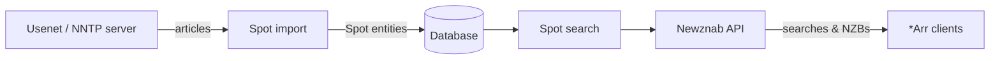

# Context

Spottarr is a self-hosted application that indexes [Spotnet](https://github.com/spotnet/spotnet/wiki)
messages from Usenet and exposes them as a [Newznab](https://newznab.readthedocs.io/) indexer, so that
*Arr tools (Radarr, Sonarr, Readarr, Lidarr, Prowlarr, etc.) can search them like any other indexer.

This document is the canonical glossary for the project's domain language. When naming things in code,
issues, PRDs, tests, or proposals, prefer the terms defined here over synonyms.

## The big picture

Spottarr **imports** Spotnet messages from a Usenet provider over **NNTP**, parses them into **Spot**
entities, stores them in a database, and serves them through a **Newznab**-compatible HTTP API that
*Arr clients query.

## Core domain terms

- **Spotnet** — a decentralized indexing protocol layered on top of Usenet. Instead of a central
  indexing website, posters publish signed messages ("spots") to dedicated Usenet groups. Spottarr is
  a Spotnet *client and indexer*.
- **Spot** — the central domain entity (`Spotnet.Data.Entities.Spot`). A single Spotnet message
  describing a release: its title, description, poster, size, category metadata, and pointers to the
  actual content (an NZB) and an optional preview image. This is what gets indexed and searched.
- **Spotter** — the identity (nickname) of the user who posted a spot. Stored on `Spot.Spotter`.
- **SpotType** — the top-level kind of a spot: `Image` (video/movies/TV), `Audio`, `Game`, or
  `Application`. Note the enum name `Image` covers visual media (film/TV), not just still pictures.
- **Release title** — the normalized scene-style title parsed out of a spot
  (`Spot.ReleaseTitle`), as distinct from the human-friendly `Title`.
- **Tag** — free-text label attached to a spot by the spotter.
- **Moderation command** — a spot can carry a command (`None` or `Delete`); a `Delete` command from a
  moderator key retracts a previously posted spot.
- **KeyId** — identifies who signed a spot: `Moderator` (2) or `SelfSigned` (7). Used to distinguish
  moderator actions from ordinary posters.
- **Adult content** — spots in adult categories. Importing these is opt-in via
  `Spotnet.ImportAdultContent`.

## Usenet / NNTP terms

- **NNTP** — Network News Transfer Protocol, the wire protocol used to talk to a Usenet provider.
- **Usenet provider** — the upstream news server Spottarr connects to (configured via `Usenet.*`
  options: hostname, port, credentials, TLS, max connections).
- **Article** — a single Usenet message. Spots, their NZBs, and their images are all stored as
  separate articles referenced by **message ID**.
- **Message ID** — the unique identifier of a Usenet article. A `Spot` holds its own `MessageId`,
  plus `NzbMessageId` and `ImageMessageId` for its attachments.
- **Article number** — the sequential per-group number of an article. Because NNTP can't look up an
  article by date, Spottarr **binary-searches** article numbers to find where a given
  `RetrieveAfter` date falls (`SpotnetArticleNumberService`).
- **Newsgroup / SpotGroup** — the Usenet group(s) spots are read from. Related groups exist for
  comments, reports, and NZBs (`Spotnet.SpotGroup`, `CommentGroup`, `ReportGroup`, `NzbGroup`).
- **NZB** — an XML file describing the Usenet articles that make up the actual downloadable content.
  Spottarr serves NZBs to *Arr clients; the NZB itself lives in a separate article
  (`NzbMessageId`).
- **NntpClientPool** — a pool of reusable, leased NNTP connections, bounded by
  `Usenet.MaxConnections`.

## Newznab / serving terms

- **Newznab** — the de-facto standard indexer API that *Arr tools speak. Spottarr implements its
  `caps` (capabilities), search, and NZB-download endpoints (`Spottarr.Web/Newznab`).
- **Capabilities (`caps`)** — the document advertising what the indexer supports: server info,
  limits, registration, searching, and the category tree.
- **NewznabCategory** — the standardized numeric category taxonomy (e.g. `2000` Movies, `1000`
  Console). Spot metadata is mapped onto these via `NewznabCategoryMapper`.
- **SpotSearchFilter** — the parsed query a *Arr sends: free-text query, categories, types, years,
  seasons/episodes, IMDB id, and paging (offset/limit).
- **API key** — optional Newznab authorization (`Newznab.ApiKey`); when unset the API is open.
- **\*Arr / client** — Radarr, Sonarr, Readarr, Lidarr, Prowlarr and similar tools that consume
  Spottarr as a Generic Newznab indexer.

## Processes & jobs

- **Import** — the process of fetching articles from the SpotGroup, parsing them into `Spot`
  entities, and bulk-inserting them. Runs on a schedule (`ImportSpotsJob`,
  `Spotnet.ImportSpotsSchedule`) starting from `RetrieveAfter`, in batches of
  `ImportBatchSize`.
- **Indexing** — making an imported spot searchable. `Spot.IndexedAt` records when a spot entered
  the search index; `SpotReIndexingService` rebuilds it.
- **Full-text search (FTS)** — the search index over spot titles/descriptions. SQLite uses an
  `FtsSpot` virtual table; PostgreSQL uses a `SearchVector` (`tsvector`). `SpotSearchService` queries
  it.
- **Clean-up** — scheduled deletion of spots older than `Spotnet.RetentionDays`
  (`CleanUpSpotsJob`, `SpotCleanUpService`); `0` means unlimited retention.
- **Spotted at vs. indexed at** — `SpottedAt` is when the spot was originally posted to Usenet;
  `IndexedAt` is when Spottarr indexed it. Don't conflate them.

## Architecture & projects

- **Spottarr.Web** — ASP.NET host exposing the Newznab API and an HTMX status UI; the deployable.
- **Spottarr.Services** — domain/application logic: Spotnet parsing, import, search, jobs.
- **Spottarr.Data** — EF Core entities and the `SpottarrDbContext`.
- **Spottarr.Data.Sqlite / Spottarr.Data.PostgreSql** — provider-specific migrations and FTS
  implementations. SQLite is the default; PostgreSQL is experimental.
- **Spottarr.Configuration** — strongly-typed options sections (`Usenet`, `Spotnet`, `Newznab`,
  `Database`).
- **Spottarr.Console** — a console entry point for running imports outside the web host.
- **Parsers** — the family of parsers under `Spottarr.Services/Parsers` and `/Spotnet` that turn raw
  NNTP headers and Spotnet XML into structured data (e.g. `SpotnetHeaderParser`, `SpotnetXmlParser`,
  `NzbArticleParser`, `ReleaseTitleParser`, `ImdbIdParser`, `BbCodeParser`,
  `YearEpisodeSeasonParser`).

## Naming conventions to keep

- A **Spot** is always a Spotnet message/release record, never a generic "item" or "post".
- The person who posted a spot is a **Spotter**, not "author" or "user".
- Use **import** for fetching from Usenet and **index** for making spots searchable — they're
  distinct steps.
- Use **\*Arr** (or "Arr client") for the downstream consumers, not "Radarr" generically.
