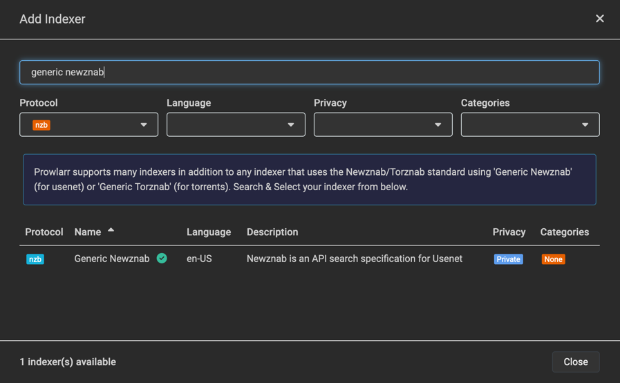
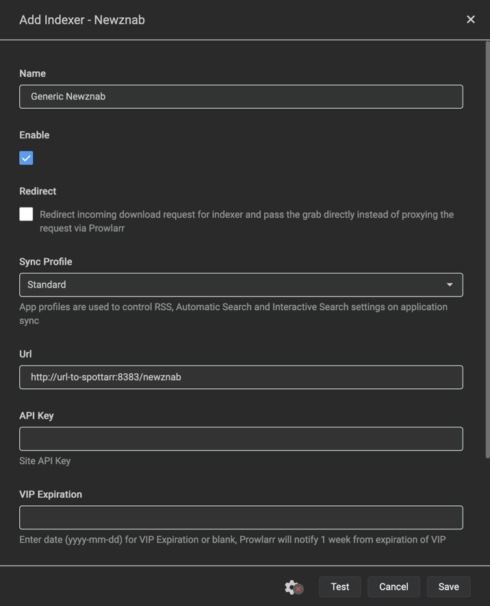
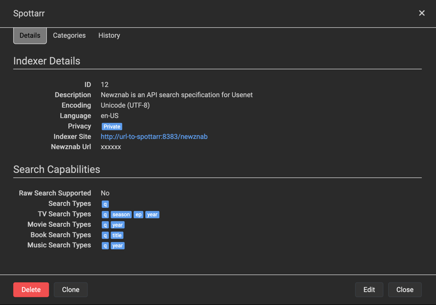

# Spottarr
_A modern spotnet client and index for your *Arrs._

[](https://hub.docker.com/r/spottarr/spottarr)

[Spotnet](https://github.com/spotnet/spotnet/wiki) is a protocol on top of Usenet that provides a decentralized alternative to indexing websites. 

Spottarr is a small application that can index the spotnet messages (spots) and exposes them as a newznab indexer.

Using Spottarr it becomes very easy to search spots directly from Radarr, Sonarr, Readarr, Lidarr, Prowlarr and many other newznab compatible tools. 


## Motivation
Spotnet provides a great decentralized source for Usenet indexing, but most existing clients are no longer maintained desktop applications, or building on top of a relatively outdated codebase.

While some alternatives like [Spotweb](https://github.com/spotweb/spotweb) are still very much alive, I've personally had some issues matching the search results when searching from *Arrs.

The aim of Spottarr is to provide a more modern application that aims for efficiency and more precise search results, while leaving the media management and browsing to the existing *Arrs.

## Installing and running
Spottarr can easily be integrated in your existing *Arrs using docker compose:
```yaml
services:
  spottarr:
    image: ghcr.io/spottarr/spottarr:latest
    container_name: spottarr    
    environment:
      - "USENET__HOSTNAME=my.news.server.com"
      - "USENET__USERNAME=username"
      - "USENET__PASSWORD=somep@ssw0rd"
      - "USENET__PORT=563"
      - "USENET__USETLS=true"
      - "USENET__MAXCONNECTIONS=10"
      - "SPOTNET__RETRIEVEAFTER=2024-10-01T00:00:00Z"
      - "SPOTNET__IMPORTBATCHSIZE=10000"
      - "SPOTNET__IMPORTADULTCONTENT=false"
    volumes:
      - /path/to/spottarr/data:/data
    ports:
      - "8383:8383"
    restart: unless-stopped
```
**Note** Make sure to properly escape special characters like `$` in your password.

**Note** Spottarr runs as the non-privileged user `app` with the uid `1654`. It might be necessary to grant this user permissions to the mounted data directory on the host machine. 

Once the Spottarr is up and running, it will automatically start indexing the spotnet messages starting from the provided `SPOTNET_RETRIEVEAFTER` date.

## Integrating with *Arrs
After starting Spottarr, it can easily be connected to the *Arr of your choice:

1. In your *Arr add a new indexer and search for *Generic Newznab*

2. In the **Url** field fill out the URL of your Spottarr instance 

3. Spottarr will now be used for searches


**Note** Spottarr does not require an API key, anyone with access to your Spottarr instance can perform searches on it.

## Issues, requests and improvements
Issues can be used to submit application errors as long as the issue template is properly filled out.

Requests for new functionality will only be considered if you can at the least provide a technical proposal and preferably a PR. 

The aim is to keep Spottarr as simple as possible, but any suggestions to improve indexing are of course welcome. 
